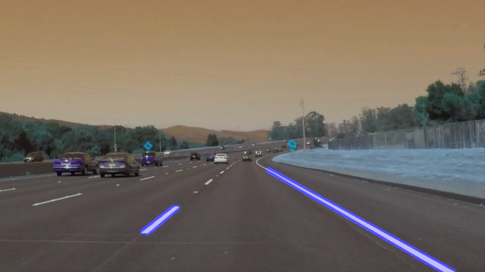

# **Finding Lane Lines on the Road** 

---

**Finding Lane Lines on the Road**

The goals / steps of this project are the following:
* Make a pipeline that finds lane lines on the road
* Reflect on your work in a written report

[//]: # (Image References)

[image1]: ./examples/grayscale.jpg "Grayscale"

---

### Reflection

### 1. Describe your pipeline. As part of the description, explain how you modified the draw_lines() function.

My pipeline consisted of 7 steps.

Step 1 : Color Selection
I selected color by taking 200 as the threshold value

Output :

Step 2 : Region Selection
I further narrowed the region of interest to a triangle defined by it's 3 edges, after a few attempts of trail and error I was able to get the window

Output :

Step 3 : Gray Scaling
In order to prepare image for Gaussian transformation I changed the image to grayscale using helper method grayscale which inturn used cv2 library method v2.cvtColor()

Output :

Step 4 : Gaussian Transformation
I transformed the image for being processed by canny edge detection algorithm, I applied gaussian filter in order to smoothen it.
I used a kernel size 5 for this.

Output :

Step 5 : Canny Edge Detection
Using the helper method for canny edge detection I got the gradient image for the input image I passed.
It gave gradients which will later be used in hough transformation to find connected lines.
I used low_threshold, high_threshold ratio to 1:3

Output :

Step 6 : Hough Transformation
This was the step which was of prime importance here the interesecting lines based on min_line_len and max_line_gap I found out line segments which can be used to mark lane. Based on 15 votes I calculated these segments.

Output :

Step 7 : Adding Weights
I superimposed the image on top of original image with the help of a helper function which was based on formuls :
initial_img * a + img * ß + ?

In order to draw a single line on the left and right lanes, I modified the draw_lines() function by calculating values for slope and intercept afterwards I checked for outliers and splitted let and right lane coordinates.
I calculated Region of Interest using imshape and averaged the mean and slopes in order to calculate coordinates which I later plotted on image to get uniform lines.

Final Output :

### 2. Identify potential shortcomings with your current pipeline

One potential shortcoming would be what would happen when more elements with white color will come in region of interest

### 3. Suggest possible improvements to your pipeline

A possible improvement would be to remove more outliers as I was able to observe some outliers which I'll get rid of later on.
